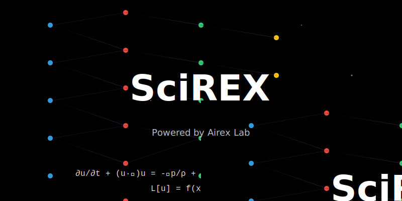

# Welcome to SciREX 🚀

**SciREX** is a revolutionary scientific computing framework that bridges the gap between traditional machine learning and advanced scientific computing. Developed by Airex Lab, it empowers researchers and engineers to solve complex scientific problems with state-of-the-art machine learning techniques.



##  Scientific Machine Learning 

At the heart of SciREX lies our advanced Scientific Machine Learning (SciML) capabilities. We're pioneering the fusion of physical knowledge with machine learning to create more accurate, efficient, and interpretable models.

### Featured SciML Components
#### FastVPINNs

 - **Finite Elements (FE)**

 - **Physics Modules**

 - **Model**

 - **Geometry**

## Traditional Machine Learning Suite

While we excel in SciML, we maintain comprehensive support for traditional machine learning approaches:

### Clustering & Classification
- Hierarchical clustering
- Spectral methods
- Deep learning
- Classification
- Ensemble methods


##  Key Features

- **High Performance**: Optimized implementations for both CPU and GPU
- **Scalability**: From  experiments to HPC 

##  Getting Started

```bash
pip install scirex
```

```python
import scirex as sx

# Initializel
model = sx.models
```

##  Documentation Structure

- **Tutorials/**
  - QuickStart Guide
  - ML Tutorial
  - FastVPINNs Examples
- **API Reference/**
  - Core API
  - Physics Modules
  - ML Algorithms


## 🤝 Community & Support

Join our growing community of scientists, researchers, and engineers who are pushing the boundaries of scientific computing:

- [GitHub Repository](https://github.com/zenoxml/SciREX/tree/main)

##  Citation

If you use SciREX in your research, please cite:

```bibtex
@software{scirex2025,
  title={SciREX},
  author={Airex Lab},
  year={2025},
  url={https://github.com/zenoxml/SciREX/tree/main}
}
```

---

<div align="center">
  <i>Powered by Airex Lab (IISc) - Aritifical Intelligence Research Exellence Lab</i>
</div>