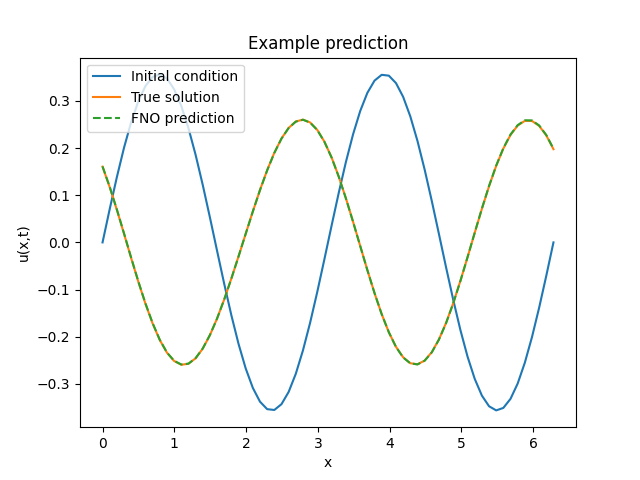
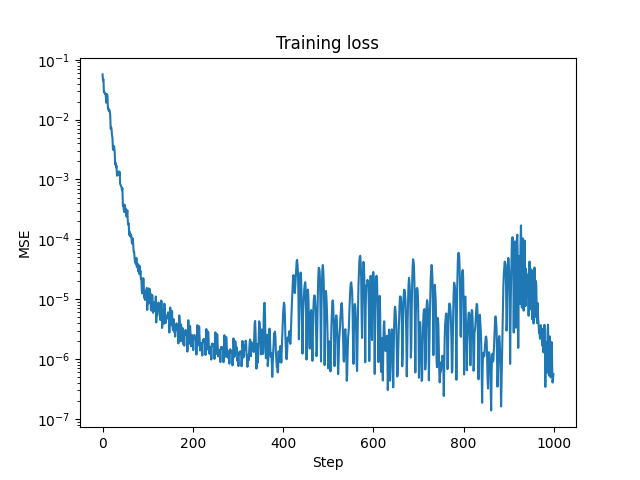
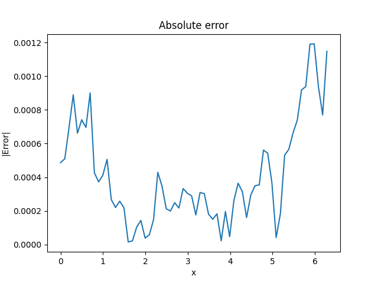

# Fourier Neural Operator (FNO) - Training Tutorial - 1D Advection Problem

## Overview

This tutorial demonstrates implementing a Fourier Neural Operator (FNO) to solve the 1D advection equation using JAX and Equinox.

## Mathematical Formulation

The 1D advection equation:

$$
\frac{\partial u}{\partial t} + v\frac{\partial u}{\partial x} = 0
$$

where:
- $u(x,t)$: solution (wave amplitude)
- $v$: wave velocity
- $x$: spatial coordinate
- $t$: time

### Initial and Boundary Conditions

- Initial condition: $u(x,0) = u_0(x)$
- Periodic boundary conditions: $u(0,t) = u(2\pi,t)$

## Implementation Parameters

### Domain Parameters
```python
nx = 64  # Spatial resolution
nt = 100  # Temporal resolution
L = 2 * π  # Domain length
T = 2.0  # Final time
v = 1.0  # Wave velocity
```

### Dataset Parameters
```python
n_samples = 1200  # Total samples
train_samples = 1000
test_samples = 200
```

### FNO Architecture
```python
model = FNO1d(
    in_channels=2,
    out_channels=1,
    modes=16,
    width=64,
    activation=jax.nn.gelu,
    n_blocks=4
)
```

## Code Components

### Data Generation
```python
def generate_advection_data(n_samples=1200, nx=64, nt=100, v=1.0):
    """Generate data for the 1D advection equation"""
    # Domain setup
    L = 2 * jnp.pi
    dx = L / nx
    x = jnp.linspace(0, L, nx)
    
    # Time domain
    T = 2.0
    dt = T / nt
    t = jnp.linspace(0, T, nt)
```

### Initial Condition Generator
```python
def generate_initial_condition(key):
    """Generate random sinusoidal initial conditions"""
    k1, k2 = jax.random.split(key)
    n_waves = 3
    amplitudes = jax.random.uniform(k1, (n_waves,), minval=0.1, maxval=1.0)
    frequencies = jax.random.randint(k2, (n_waves,), minval=1, maxval=4)
```

### Advection Solver
```python
def solve_advection(u0):
    """Solve using upwind scheme"""
    u = jnp.zeros((nt, nx))
    u = u.at[0].set(u0)
    
    for n in range(1, nt):
        if v > 0:
            u = u.at[n].set(
                u[n-1] - v * dt/dx * (u[n-1] - jnp.roll(u[n-1], 1))
            )
```

### Training Loop
```python
@eqx.filter_jit
def make_step(model, opt_state, batch):
    """Single training step"""
    def loss_fn(model):
        pred = jax.vmap(model)(batch[0])
        return jnp.mean((pred - batch[1])**2)
    
    loss, grads = eqx.filter_value_and_grad(loss_fn)(model)
    updates, opt_state = optimizer.update(grads, opt_state, model)
    model = eqx.apply_updates(model, updates)
    return loss, model, opt_state
```

## Results Visualization

```python
# Example prediction
plt.figure()
plt.plot(spatial_grid, test_x[0, 0], label='Initial condition')
plt.plot(spatial_grid, test_y[0, 0], label='True solution')
plt.plot(spatial_grid, test_pred[0, 0], '--', label='FNO prediction')

# Training loss
plt.figure()
plt.semilogy(losses)

# Error analysis
plt.figure()
plt.plot(spatial_grid, jnp.abs(test_pred[0, 0] - test_y[0, 0]))
```

## Output Structure

```
outputs/fno/advection/
├── advection_example.png
├── advection_loss.png
└── advection_error.png
```

## Output Visualization




