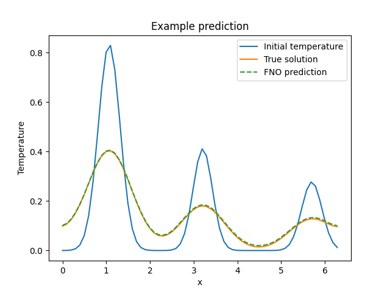
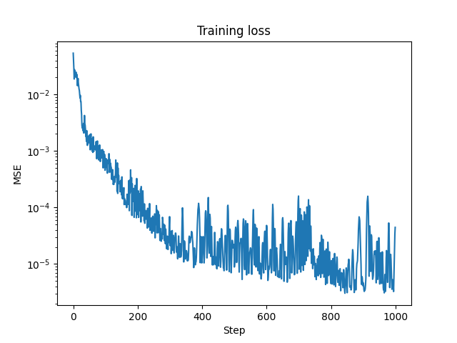
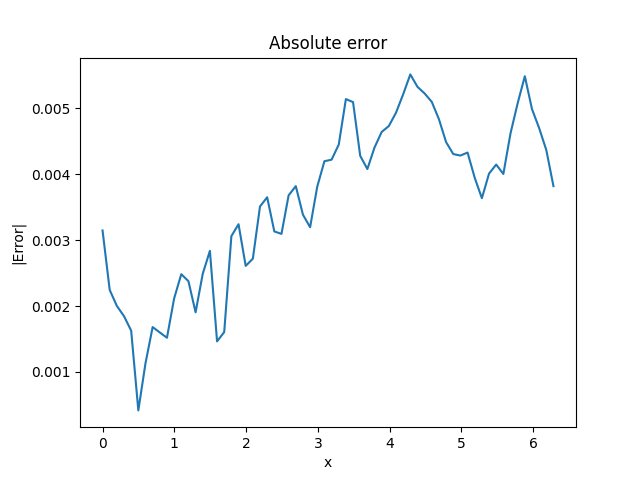

# Fourier Neural Operator (FNO) - Training Tutorial - Heat Equation

## Mathematical Formulation

The heat equation:

$$
\frac{\partial u}{\partial t} = D\frac{\partial^2 u}{\partial x^2}
$$

where:
- $u(x,t)$: temperature field
- $D$: thermal diffusivity
- $x$: spatial coordinate
- $t$: time

## Implementation Parameters

### Domain Parameters
```python
nx = 64  # Spatial points
nt = 100  # Time steps
L = 2π  # Domain length
T = 1.0  # Final time
D = 0.1  # Diffusion coefficient
```

### Dataset Parameters
```python
n_samples = 1200
train_samples = 1000
test_samples = 200
batch_size = 50
epochs = 50
```

### FNO Architecture
```python
model = FNO1d(
    in_channels=2,  # Initial temperature + spatial coordinate
    out_channels=1,  # Final temperature
    modes=16,
    width=64,
    activation=jax.nn.gelu,
    n_blocks=4
)
```

## Code Components

### Initial Condition Generator
```python
def generate_initial_condition(key):
    """Generate random Gaussian pulses"""
    max_pulses = 3
    positions = jax.random.uniform(k1, (max_pulses,)) * L
    widths = jax.random.uniform(k2, (max_pulses,)) * 0.2 + 0.1
    amplitudes = jax.random.uniform(k3, (max_pulses,)) * 0.8 + 0.2
    
    u0 = jnp.zeros(nx)
    for pos, width, amp in zip(positions, widths, amplitudes):
        u0 += amp * jnp.exp(-(x - pos)**2 / (2 * width**2))
    return u0
```

### Heat Equation Solver
```python
def solve_heat_equation(u0):
    """Solve using explicit finite differences"""
    u = jnp.zeros((nt, nx))
    u = u.at[0].set(u0)
    
    for n in range(1, nt):
        u = u.at[n].set(
            u[n-1] + D * dt/dx**2 * (
                jnp.roll(u[n-1], 1) - 2*u[n-1] + jnp.roll(u[n-1], -1)
            )
        )
    return u
```

### Training Loop
```python
@eqx.filter_jit
def make_step(model, opt_state, batch):
    def loss_fn(model):
        pred = jax.vmap(model)(batch[0])
        return jnp.mean((pred - batch[1])**2)
    
    loss, grads = eqx.filter_value_and_grad(loss_fn)(model)
    updates, opt_state = optimizer.update(grads, opt_state, model)
    model = eqx.apply_updates(model, updates)
    return loss, model, opt_state
```

## Results Analysis

The implementation generates three visualizations:

1. `example_prediction.png`:
   - Initial temperature profile
   - True solution at final time
   - FNO prediction

2. `training_loss.png`:
   - MSE loss over training steps
   - Log-scale visualization

3. `absolute_error.png`:
   - Point-wise absolute error
   - Error distribution analysis

## Output Structure
```
outputs/fno/heat/
├── example_prediction.png
├── training_loss.png
└── absolute_error.png
```

## Output Visualization





