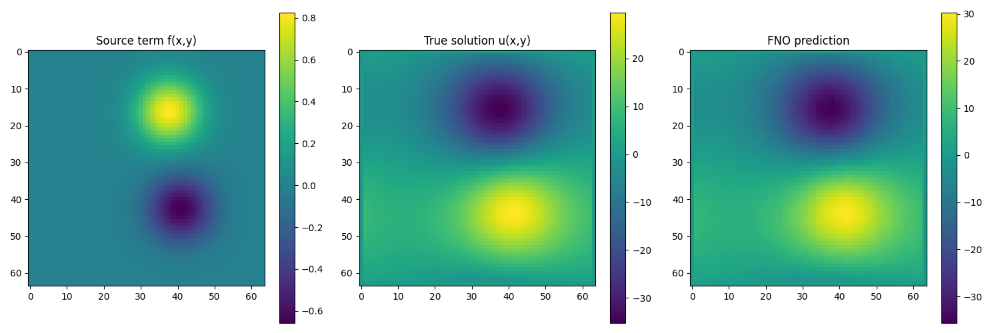
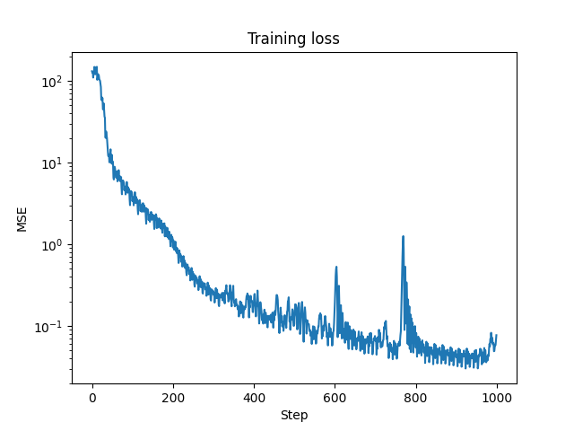

# Fourier Neural Operator (FNO) - Training Tutorial - 2D Poisson Problem

## Overview

This tutorial demonstrates implementing a Fourier Neural Operator (FNO) to solve the 2D Poisson equation using JAX and Equinox.

## Mathematical Formulation

The 2D Poisson equation:

$$
-\nabla^2 u = f(x,y)
$$

or in expanded form:

$$
-\left(\frac{\partial^2 u}{\partial x^2} + \frac{\partial^2 u}{\partial y^2}\right) = f(x,y)
$$

where:
- $u(x,y)$: solution (potential)
- $f(x,y)$: source term
- $x,y$: spatial coordinates

### Boundary Conditions

- Dirichlet boundary conditions: $u = 0$ on the boundary
- Domain: $[0,1] \times [0,1]$

## Implementation Parameters

### Domain Parameters
```python
nx = 64  # Resolution in x-direction
ny = 64  # Resolution in y-direction
Lx = 1.0  # Domain length in x
Ly = 1.0  # Domain length in y
```

### Dataset Parameters
```python
n_samples = 1200  # Total samples
train_samples = 1000
test_samples = 200
```

### FNO Architecture
```python
model = FNO2d(
    in_channels=3,      # Source term + x,y coordinates
    out_channels=1,     # Solution u(x,y)
    modes1=12,          # Fourier modes in x
    modes2=12,          # Fourier modes in y
    width=64,           # Network width
    activation=jax.nn.gelu,
    n_blocks=4
)
```

## Code Components

### Data Generation
```python
def generate_poisson_data(n_samples=1200, nx=64, ny=64):
    """Generate data for the 2D Poisson equation"""
    # Spatial domain setup
    x = jnp.linspace(0, 1, nx)
    y = jnp.linspace(0, 1, ny)
    X, Y = jnp.meshgrid(x, y)
```

### Source Term Generator
```python
def generate_source_term(key):
    """Generate random source term f(x,y) as sum of Gaussians"""
    k1, k2, k3 = jax.random.split(key, 3)
    n_sources = 3
    
    # Random parameters for Gaussian sources
    amplitudes = jax.random.uniform(k1, (n_sources,), minval=-1.0, maxval=1.0)
    centers_x = jax.random.uniform(k2, (n_sources,), minval=0.2, maxval=0.8)
    centers_y = jax.random.uniform(k3, (n_sources,), minval=0.2, maxval=0.8)
```

### Poisson Solver (Spectral Method)
```python
def solve_poisson(f):
    """Solve Poisson equation using spectral method"""
    # Wave numbers
    kx = 2 * jnp.pi * jnp.fft.fftfreq(nx)
    ky = 2 * jnp.pi * jnp.fft.fftfreq(ny)
    KX, KY = jnp.meshgrid(kx, ky)
    
    # Solution in Fourier space
    f_hat = jnp.fft.fft2(f)
    denominator = -(KX**2 + KY**2)
    u_hat = f_hat / denominator
```

### FNO Model Components

#### 2D Spectral Convolution
```python
class SpectralConv2d(eqx.Module):
    """2D Spectral Convolution layer for FNO"""
    def __call__(self, x):
        # Transform to Fourier space
        x_ft = jnp.fft.rfft2(x)
        
        # Multiply relevant Fourier modes
        out_ft = jnp.zeros((self.out_channels, x.shape[1], x_ft.shape[-1]),
                          dtype=jnp.complex64)
```

#### FNO Block
```python
class FNOBlock2d(eqx.Module):
    """2D FNO Block combining spectral and regular convolution"""
    def __call__(self, x):
        return self.activation(self.spectral_conv(x) + self.conv(x))
```

### Training Loop
```python
@eqx.filter_jit
def make_step(model, opt_state, batch):
    """Single training step"""
    def loss_fn(model):
        pred = jax.vmap(model)(batch[0])
        return jnp.mean((pred - batch[1])**2)
    
    loss, grads = eqx.filter_value_and_grad(loss_fn)(model)
    updates, opt_state = optimizer.update(grads, opt_state, model)
    model = eqx.apply_updates(model, updates)
    return loss, model, opt_state
```

## Results Analysis

The implementation generates three visualizations:

1. `poisson_example.png`: Shows three subplots side by side comparing,
    - Source term f(x,y): Shows the input Gaussian sources with varying amplitudes
    - True solution u(x,y): Ground truth solution computed using spectral method
    - FNO prediction: Network's predicted solution showing learned mapping from source to potential
    
2. `poisson_loss.png`: 
    - Training loss curve over iterations
    - Y-axis in log scale showing MSE loss
    - Demonstrates convergence behavior of the FNO training
    
3. `poisson_error.png`: 
    - Error distribution analysis showing absolute difference |u_pred - u_true|
    - 2D heatmap highlighting regions of higher prediction error
    - Helps identify where the FNO struggles (typically near boundaries or sharp gradients)

## Output Structure

```
outputs/fno/poisson/
├── poisson_example.png
├── poisson_loss.png
└── poisson_error.png
```

## Output Visualization




