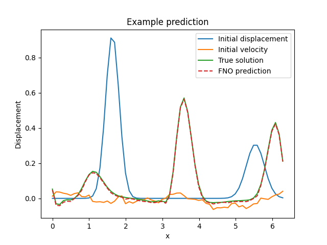
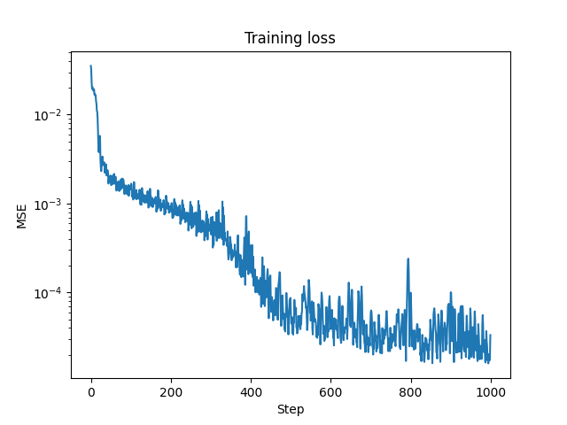
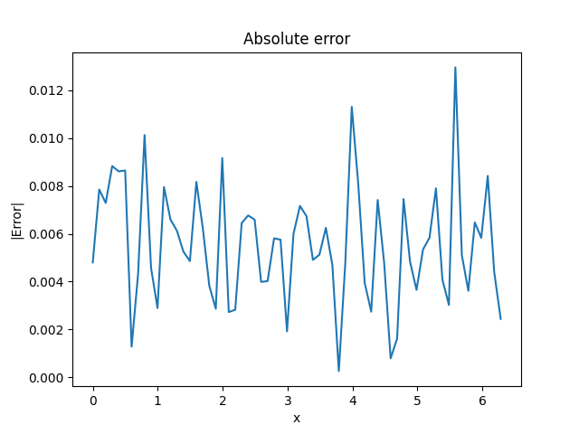

# Fourier Neural Operator (FNO) - Wave Equation Tutorial

## Mathematical Formulation

The wave equation:

$$
\frac{\partial^2 u}{\partial t^2} = c^2\frac{\partial^2 u}{\partial x^2}
$$

where:
- $u(x,t)$: displacement field
- $c$: wave speed
- $x$: spatial coordinate
- $t$: time

## Parameters

### Domain Parameters
```python
nx = 64  # Spatial points
nt = 100  # Time steps
L = 2π  # Domain length
T = 2.0  # Final time
c = 1.0  # Wave speed
```

### Architecture Parameters
```python
model = FNO1d(
    in_channels=3,  # Initial displacement + velocity + coordinate
    out_channels=1,  # Final displacement
    modes=16,
    width=64,
    activation=jax.nn.gelu,
    n_blocks=4
)
```

## Implementation

### Initial Conditions Generator
```python
def generate_initial_conditions(key):
    # Initial displacement (Gaussian pulses)
    max_pulses = 2
    positions = jax.random.uniform(k1, (max_pulses,)) * L
    widths = jax.random.uniform(k2, (max_pulses,)) * 0.2 + 0.1
    amplitudes = jax.random.uniform(k3, (max_pulses,)) * 0.8 + 0.2
    
    # Initial velocity (smoothed random)
    v0 = jax.random.normal(k4, (nx,)) * 0.1
    v0 = jnp.convolve(v0, jnp.ones(10)/10, mode='same')
    
    return u0, v0
```

### Wave Equation Solver
```python
def solve_wave_equation(init_conditions):
    """Central differences scheme"""
    u0, v0 = init_conditions
    u = jnp.zeros((nt, nx))
    u = u.at[0].set(u0)
    u = u.at[1].set(u0 + dt * v0)
    
    for n in range(2, nt):
        u = u.at[n].set(
            2 * u[n-1] - u[n-2] + 
            (c * dt/dx)**2 * (
                jnp.roll(u[n-1], 1) - 2*u[n-1] + jnp.roll(u[n-1], -1)
            )
        )
    return u
```

### Training Loop
```python
@eqx.filter_jit
def make_step(model, opt_state, batch):
    def loss_fn(model):
        pred = jax.vmap(model)(batch[0])
        return jnp.mean((pred - batch[1])**2)
    
    loss, grads = eqx.filter_value_and_grad(loss_fn)(model)
    updates, opt_state = optimizer.update(grads, opt_state, model)
    model = eqx.apply_updates(model, updates)
    return loss, model, opt_state
```

## Output Visualization

```
outputs/fno/wave/
├── example_prediction.png  # Initial conditions, true solution, prediction
├── training_loss.png      # MSE loss evolution
└── absolute_error.png     # Point-wise absolute error
```

## Output Visualization






### Key Metrics
- MSE Loss tracking
- Test set error evaluation
- Point-wise error analysis

## Features
- Handles coupled initial conditions (displacement and velocity)
- Multi-component input processing
- Periodic boundary conditions
- Second-order accuracy in time and space